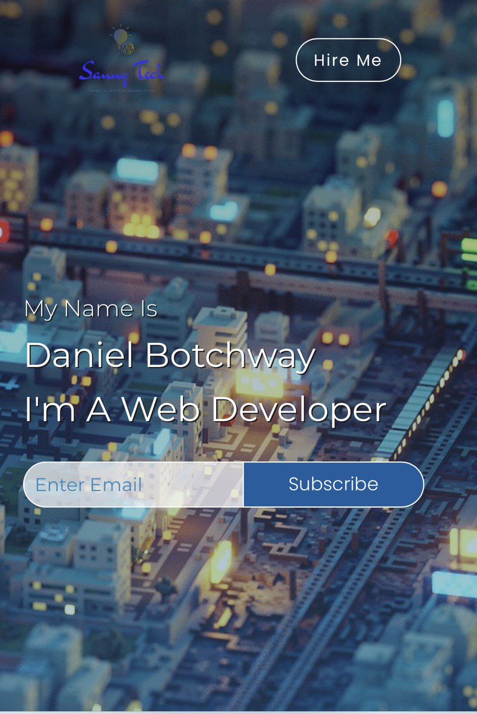
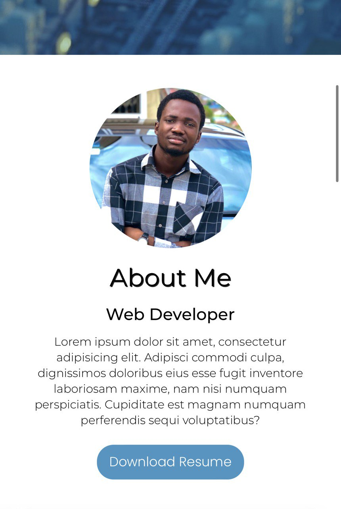

## **Portfolio Site ✌**

Make your own **unique Portfolio Website**. Customize and build your own Portfolio with by editing this Template.

#### **Getting Started**

Install NodeJS on your computer

[**NODE JS**](https://nodejs.org)

***Run:*** 

```shell
npm install
```


**Packages used**

- gulp
- gulp-sass
- gulp-imagemin
- gulp-connect-php
- browser-sync
- gulp-uglifycss

**Task Commands**

Run  ```gulp run``` to process files for display.

```sh 
npm run test
```

Run  ``` gulp watch``` to initiate gulp watch

```shell
npm run watch
```

Run ```gulp clean ``` to clean distribution folder or directory.

```shell
npm run clean
```

Run ```gulp dist``` to organize all files into distribution directory.

```shell
npm run dist
```


**Mobile View**






**Desktop**

*Loading… :rocket:*
